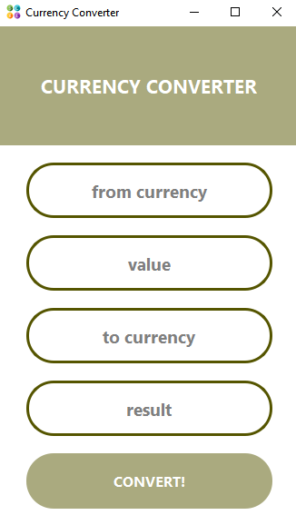

## Currency converter

### Краткое описание

Конвертер валют с графическим интерфейсом с использованием библиотеки PyQt6. 
Получение данных - сервис API ЦБ РФ.

###Входные данные:  

`(from currency)`-  код конвертируемой валюты  
`(value)` - значение  
`(to currency)` - коду желаемой валюты  
`(result)` - результат  

### Пример:

